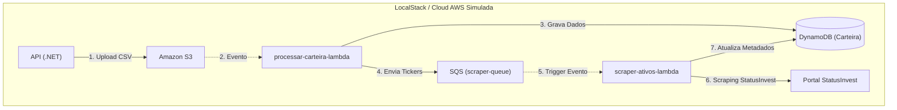

# FII Analytics Engine

## Descrição
O **FII Analytics Engine** é um sistema de engenharia de dados *serverless* projetado para automação, extração e análise de indicadores financeiros de Fundos de Imobiliários (FIIs). O projeto centraliza a coleta de dados de mercado, processamento e persistência, utilizando uma arquitetura moderna baseada em eventos e escalabilidade em nuvem.

## 🏗️ Arquitetura do Projeto
O sistema foi desenhado para ser desacoplado e resiliente:

* **Ingestão:** API .NET que persiste arquivos no **S3**.
* **Orquestração:** Infraestrutura como código (**LocalStack**), simulando AWS localmente.
* **Processamento:** Funções Lambda que reagem a eventos em filas (**SQS**).
* **Armazenamento:** Persistência estruturada em **Amazon DynamoDB**.



## 🛠️ Tecnologias Utilizadas
* 🐍 **Linguagens:** Python 3.10+ (Data Engineering) e C#/.NET (API Service).
* ☁️ **Cloud/Infra:** AWS Lambda, Amazon DynamoDB, LocalStack.
* 🕸️ **Data Scraping:** BeautifulSoup, Requests.
* 🐳 **Containerização:** Docker & Docker Compose.
* 📜 **Infraestrutura:** Bash scripts (IaC) via `init-aws.sh`.

## Fluxo de Dados Automatizado
1. 🎯 **Trigger:** O usuário faz o upload do arquivo CSV via API. O arquivo é armazenado no S3.
2. ⚙️ **Processamento:** A processar-carteira-lambda é disparada automaticamente, processa o CSV, calcula o preço médio e persiste a carteira no DynamoDB.
3. 📨 **Automação:** Para cada ativo processado, a Lambda dispara um evento na fila SQS (scraper-queue).
4. 🤖 **Enriquecimento:** A scraper-ativos-lambda é ativada automaticamente pela fila, realiza o scraping no StatusInvest e atualiza o DynamoDB com cotação, DY e P/VP.

## 🚀 Passo a Passo para Execução

### 1. Pré-requisitos
* ✅ **Ambiente de Container:** Docker e Docker Desktop instalados e em execução.
* ✅ **Ferramentas de Cloud:** AWS CLI instalado e configurado.
* ✅ **Desenvolvimento .NET:** SDK .NET 8.0+ instalado.
    
### 2. Subir a Infraestrutura Local
No terminal, na raiz do projeto, execute o comando para iniciar os containers:
> 💻 `docker-compose up -d`

### 3. Monitorar o Provisionamento 
Para verificar se os serviços foram criados com sucesso, acompanhe os logs:
```bash
docker logs -f fiianalytics_localstack
```

Obs: Você pode reduzir a quantidade de logs, vendo apenas os últimos gerados:
```bash
docker logs fiianalytics_localstack --tail 20
```

Pode validar também toda a infraestrutura AWS criada:
```bash
docker exec -it fiianalytics_localstack bash -c "echo '--- S3 Buckets ---'; awslocal s3 ls; echo -e '\n--- SQS Queues ---'; awslocal sqs list-queues; echo -e '\n--- DynamoDB Tables ---'; awslocal dynamodb list-tables; echo -e '\n--- Lambda Functions ---'; awslocal lambda list-functions"
```

> 🧪 `awslocal lambda invoke --function-name scraper-ativos-lambda --payload '{"ticker": "HGLG11"}' response.json`

### 4. Validar a Persistência no DynamoDB
```bash
aws --endpoint-url=http://localhost:4566 dynamodb scan --table-name FiiAnalyticsDb
```

## 🧪 Como testar a API
Após subir a infraestrutura e iniciar sua aplicação .NET, você pode validar o fluxo de ingestão de arquivos:

1. **Acesse o Swagger:** Com a API em execução, acesse `http://localhost:5000/swagger`.
2. **Importação de Carteira:**
   - Localize o endpoint `POST /api/v1/carteira/importar`.
   - Clique em **Try it out**.
   - No campo `X-Usuario-Id`, informe um ID (ex: `123456`).
   - Faça o upload de um arquivo `.csv` de teste no campo `file`.
   - Clique em **Execute**.
3. **Validação:** A API retornará o status `202 Accepted` e a `s3Key` do arquivo processado.

## 📝 Documentação da API (Swagger/OpenAPI)

O FII Analytics Engine expõe a estrutura de dados utilizada pelo sistema para integração com ferramentas externas ou consumo via client. Abaixo, a representação da entidade principal de dados (FII Metadata):

### Estrutura do Recurso: `Ativo`

| Campo | Tipo | Descrição |
| :--- | :--- | :--- |
| `PK` | String | Chave de Partição (ex: `ATIVO#HGLG11`) |
| `SK` | String | Chave de Ordenação (ex: `METADATA`) |
| `Ticker` | String | Código do fundo imobiliário |
| `Cotacao` | Number | Último valor de cotação extraído |
| `DividendYield` | Number | Percentual anualizado de dividendos |

> **Nota:** Para visualizar o esquema completo em formato OpenAPI, você pode importar o arquivo `docs/openapi.yaml` em ferramentas como [Swagger Editor](https://editor.swagger.io/) ou [Postman](https://www.postman.com/).

*Após o processamento, os dados estarão disponíveis no DynamoDB sob a partição `USER#123456`.*

**⚠️ Nota de Configuração:** Certifique-se de que os arquivos de script e configuração (`init-aws.sh`, `docker-compose.yml` e `Dockerfile`) estejam salvos com codificação **UTF-8** e final de linha **LF (Unix)**. Arquivos salvos com codificação Windows (CRLF) podem causar erros de sintaxe ou falhas de execução dentro dos contêineres Linux.

💡 **Dica de CLI:** Ao executar comandos `aws dynamodb` via terminal Windows (CMD/PowerShell) contra o container, atente-se às aspas. O uso de `docker exec -it <container_nome> awslocal ...` requer tratamento específico de aspas no JSON. Em caso de erro de sintaxe, prefira listar os itens com `scan` ou utilize o PowerShell para garantir a correta interpretação do JSON.

---

## 🤝 Contribuições
Contribuições são bem-vindas! Sinta-se à vontade para abrir uma *Issue* ou enviar um *Pull Request* caso encontre melhorias, correções de bugs ou novas funcionalidades para o pipeline.

---
*Desenvolvido com foco em arquitetura de sistemas distribuídos, processamento de dados em Python e boas práticas de desenvolvimento .NET.*
